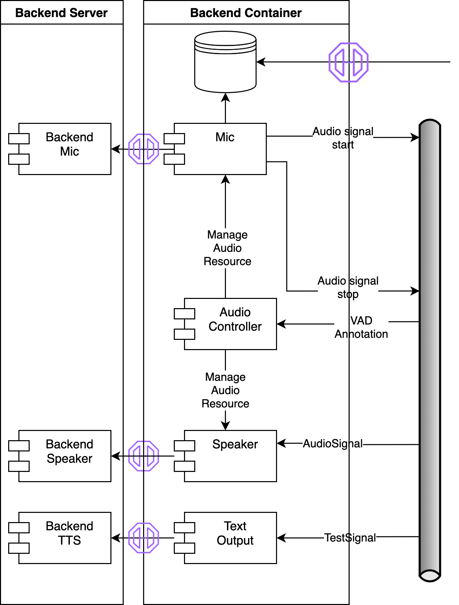

# cltl-backend

Backend services for the Leolani platform.

## Backend Architecture

#### Backend layer

The Backend Container connects to the backend server to retrieve raw signals and processes them to
make them available in the application. This involves:
* Managing access to the signal resources (e.g. mute mic while speaking).
* Store raw signal data.
* Publish events for the incoming signals, pointing to the storage location where the raw data can be retrieved.
* Subscribe to events that result in outgoing signals and send them to the backend server.

### Backend Server

The application is composed of the following components:
The Backend Server is a standalone application that provides a REST API with the basic raw signals.

#### Storage

The Backend stores the signal data separately and provides access to the stored
signals over a REST API.